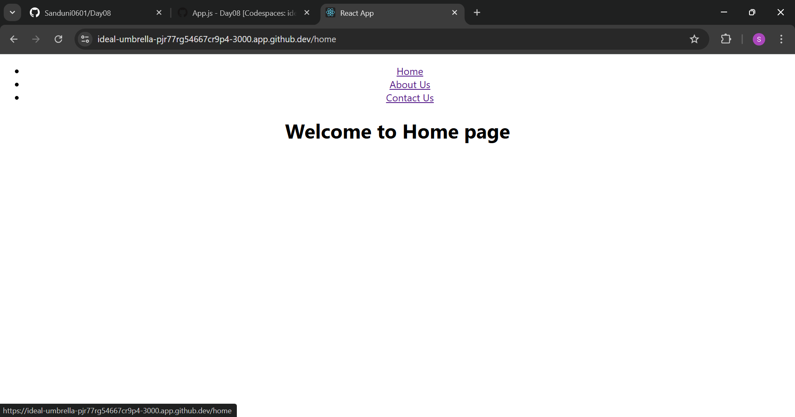
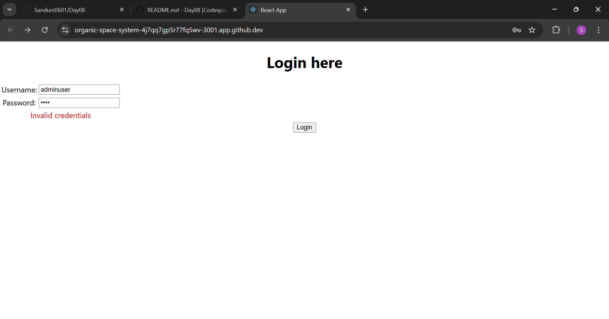
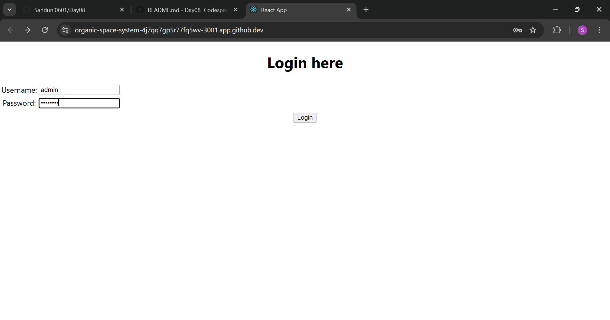
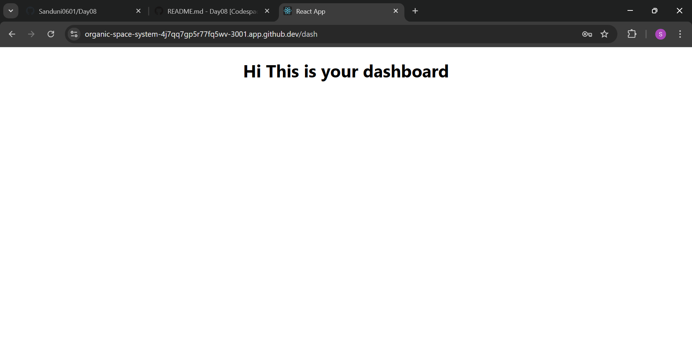

# React Navigation

React Navigation is a popular library for managing navigation in React Native applications. It allows you to create navigational structures such as:

Stack Navigation: For navigating between screens in a stack-like manner (e.g., moving forward/backward between pages).  
Tab Navigation: For switching between screens using bottom or top tabs.  
Drawer Navigation: For sliding menu-style navigation from the side.  
It provides easy-to-use APIs for creating and handling transitions, passing data between screens, and customizing navigational components. React Navigation is widely used for its flexibility and community support.

# day08_1

/Home

/about

/contact

# day08_2

Here,I have set default username and password for login.If username and password is correct only, the user can navigate to dashboard

If the user enters invalid credentials, the output is:

If the user enters valid credentials, the output is:

/dash
